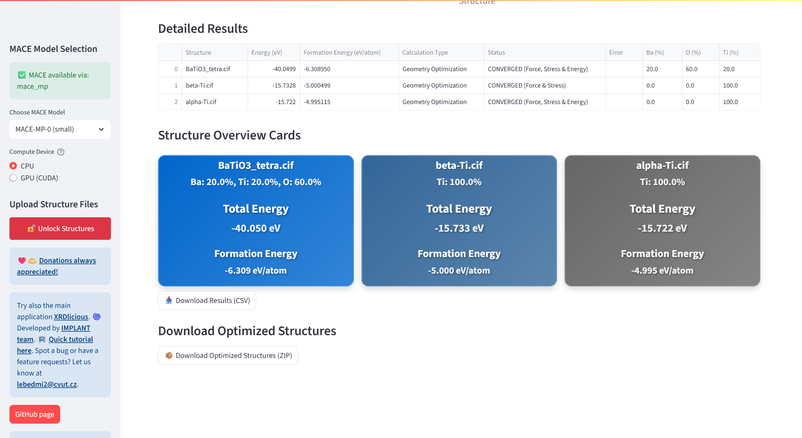
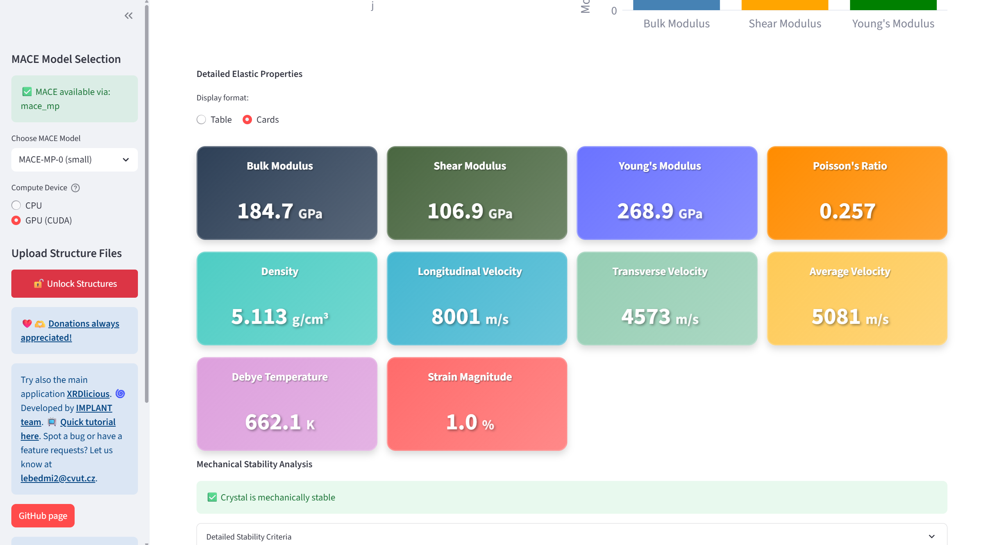
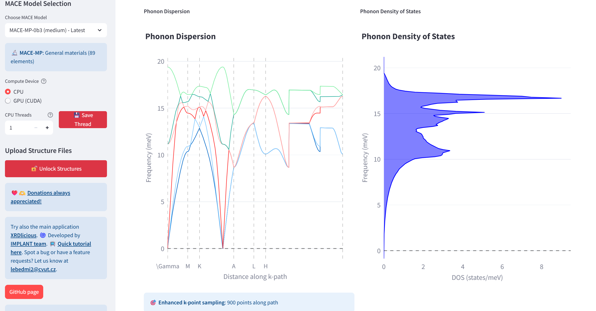

# Interactive interface for MACE machine learning interatomic potential calculations

Run basic molecular dynamics/static simulations (**single-point energy, geometry optimization, elastic properties, phonons, genetic algorithm for finding the energetically most favorible atomic site configurations of substitutes/vacancies**) in an **interactive interface for multiple input structure files** (POSCAR, CIF, LMP, XYZ with lattice) with a **machine learning MACE MP** interatomic potential. It is also possible to generate Python code with the set settings and run the simulations directly in the console (this option currently works for energies, geometry optimization, and elastic properties). For the generated Python code, simply put it into an empty folder and run it. The structures that were uploaded to the app will be automatically created in the POSCAR format before the simulation start. 
The application also **supports selective dynamics in POSCAR** files, preserving the set constraints for specific atoms.

- **Video tutorial for the calculations within the interface at [YouTube](https://youtu.be/xh98fQqKXaI?si=m0Hysd9dvZis0any)**.   
- **Video tutorial for using the genetic algorithm with MACE to obtain candidates for the lowest energy distributions of point defects in crystal structure [YouTube](https://youtu.be/SXUsAsatyRQ?si=3MKPwuyHk7AtLNeK)**.   
- **Video tutorial for using the generated Python script for the calculations at [YouTube](https://youtu.be/w6hmvzC2J-8?si=9BYWJuUg7pohL1sw).** Make sure that before running the Python code, you activated the virtual Python environment with the installed necessary Python packages (Step 4 in the compilation manual below).   

If you using my app, do not forgot from time to time to **update it with 'git pull' in the main folder**, I might be adding additional small features.   
If you have any request for improvements, additional features, or you spot a bug, please let me know: **lebedmi2@cvut.cz**  
Personal recommendation for the **maximum number of atoms** (for energies, geometry optimization) in a structure file: **below 1 000**. 

Supported MACE MLIPs:  
**Anorganic**:  
- MP-0, MP-0b3, MPA, OMAT,  
- MATPES-PBE-0, MATPES-r2SCAN-0  

**Organic**:
- MACE-OFF23  
---

### **Compile the app**  

For calculations on **GPU, compile CUDA**:  
https://developer.nvidia.com/cuda-toolkit  
Do not forget to **add it to the PATH**, e.g.:  
- In your console, open bashrc: 'nano ~/.bashrc'  
- Scroll to the end of the file  
- Add the following two lines to the end of the file (modify accordingly for your version of CUDA, mine is 12.9):  
export PATH=/usr/local/cuda-12.9/bin:$PATH  
export LD_LIBRARY_PATH=/usr/local/cuda-12.9/lib64:$LD_LIBRARY_PATH  
- Save the changes: press 'ctrl + c', and exit the nano with 'ctrl + x'  
- Reload the config file by writting in console: 'source ~/.bashrc'
  

**Compile the app:** Open your terminal console and write the following commands (the bold text):  
(Optional) Install Git:  
      **sudo apt update**  
      **sudo apt install git**    
      
1) Download the app code from GitHub (or download it manually without Git on the following link by clicking on 'Code' and 'Download ZIP', then extract the ZIP. With Git, it is automatically extracted):  
      **git clone https://github.com/bracerino/mace-md-gui.git**

2) Navigate to the downloaded project folder:  
      **cd mace-md-gui/**

3) Create a Python virtual environment to prevent possible conflicts between packages:  
      **python3 -m venv mace_env**

4) Activate the Python virtual environment (before activating, make sure you are inside the mace-md-gui folder):  
      **source mace_env/bin/activate**
   
5) Install all the necessary Python packages:  
      **pip install -r requirements-pc.txt** (with CUDA for calculations on GPU), or (pip install -r requirements-no-cuda.txt (No GPU calculations))  

7) Run the app (always before running it, make sure to activate its Python virtual environment (Step 4):  
      **streamlit run app.py**
8) To update the application, write in the main folder:  
      **git pull**
 
### **Tested Python packages**  
- streamlit - 1.46.0  
- plotly - 6.1.2  
- pymatgen - 2025.6.14  
- ase - 3.25.0  
- phonopy - 2.40.0  
- py3Dmol - 2.5.0  
- psutil - 7.0.0  
- gputil - 1.4.0  
- torch - 2.7.1  
- torchvision - 0.22.1    
- torchaudio - 2.7.1
- mace-torch - 0.3.13    
- cuequivariance - 0.5.1  
- cuequivariance-torch - 0.5.1  
- cuequivariance-ops-torch-cu12 - 0.5.1  

### **Workflow**

---

---

---

---

---

---

